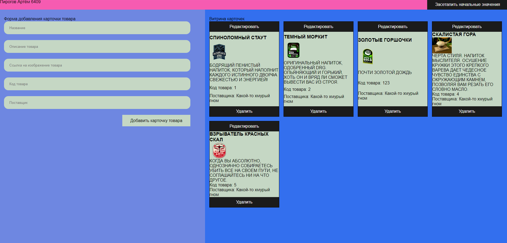
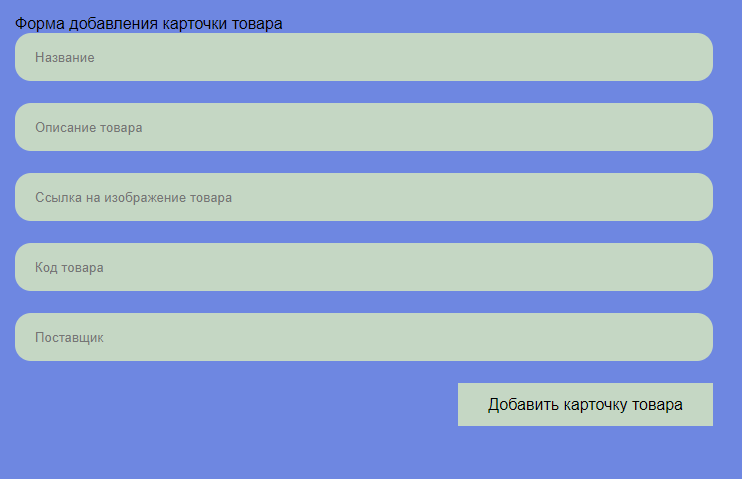
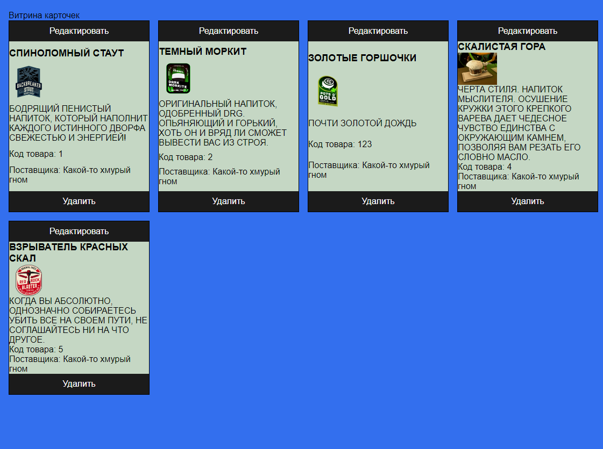
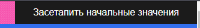
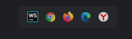

Админка карточек (товаров):

Слева присутствует форма для создания и добавления и редактирования карточек:

Справа есть витрина, которая показывает все созданные карточки:

Есть кнопка, которая позвоялет задать начальные карточки на сайте: Сетап кнопка 

На каждой карточке есть надпись "Редактировать", которая переносит данные на форму и позволяет их редактировать и сохранять. 
Проект запускался просто через live server webstorm , сторонних зависимостей не было.
Для запуска сервера:

npm install -g json-server База данных приведена в файле db.json Запустить JSON сервер:
json-server --watch db.json

 P.S У МЕНЯ УДАЛИЛИСЬ ВСЕ СТИЛИ И Я ИХ НЕ СМОГ ВОССТАНОВИТЬ, НАКИДАЛ ПРОСТО ПОТОМУ ЧТО НЕОБХОДИМЫ, ЛОГИКА ФУЛЛ СВОЯ, НЕ БЕЙТЕ ПАЛКАМИ ПРОШУ

